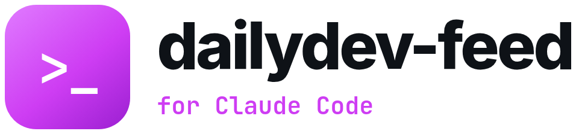
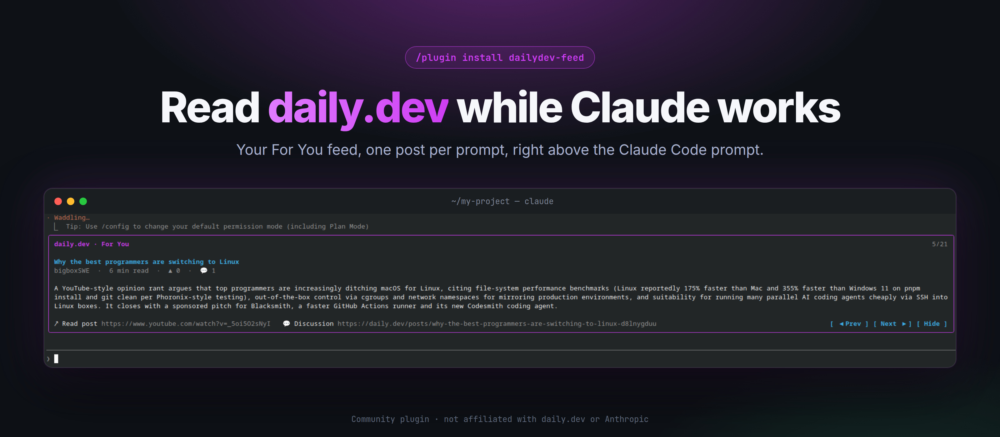

<p align="center">
  <picture>
    <source media="(prefers-color-scheme: dark)" srcset="docs/logo/dark.png">
    <source media="(prefers-color-scheme: light)" srcset="docs/logo/light.png">
    
  </picture>
</p>

<p align="center">
  <a href=".claude-plugin/plugin.json"></a>
  <a href="LICENSE"></a>
  <a href="https://code.claude.com/docs/en/plugins"></a>
  <a href="https://docs.daily.dev/mcp-server/"></a>
</p>

<p align="center"><b>Waiting on Claude? Read daily.dev.</b></p>

<p align="center">
  <a href="#install">Install</a> |
  <a href="#how-it-works">How it works</a> |
  <a href="#api-usage">API usage</a> |
  <a href="#develop">Develop</a>
</p>

<p align="center">
  
</p>

Read your daily.dev **For You** feed inside Claude Code while it works on your prompt. One post per turn, with its summary, links and buttons to page through. Waiting on the agent becomes reading time.

## What you get

- One post from your personalized feed in a band above the prompt, shown only while Claude is working.
- Title, source, read time, upvotes, comments, top tags and a three-line summary, in a daily.dev-purple frame.
- A `3/30` counter showing where you are in the batch.
- Clickable links to the post and to its daily.dev discussion.
- `Prev` / `Next` / `Hide` buttons, and a new post on every prompt.
- `/dailydev` toggles the band on and off.

## Install

1. Connect the daily.dev MCP server. The name must be exactly `daily-dev`:

   ```
   claude mcp add -s user --transport http daily-dev https://api.daily.dev/mcp
   ```

   Then run `/mcp` in Claude Code and sign in with daily.dev.

2. Install the plugin at the Claude Code prompt:

   ```
   /plugin install dailydev-feed --marketplace DixitRam/dailydev-claude-code
   ```

   Answer `y` to add the marketplace, then pick a scope.

## How it works

1. When a session starts, the plugin asks the `daily-dev` MCP server for 30 posts from your For You feed, using the login Claude Code already holds. No API token to copy.
2. While a turn runs, the band shows the current post. When the turn ends, it moves to the next one.
3. The posts and your place in them are cached for 8 hours, across sessions.

## API usage

MCP tool calls count toward your daily.dev API quota. The 8-hour cache keeps the plugin to at most 3 feed requests a day, about 90 a month, regardless of how many sessions you open.

## What it needs

- Claude Code (terminal or desktop app) with plugin hooks support.
- The `daily-dev` MCP server connected and signed in.
- Read access only. The plugin never changes anything on your daily.dev account.

If the server is not connected or the sign-in has expired, the band simply stays hidden.

## Develop

```
claude --plugin-dir .          # run it from this folder
claude plugin validate .
claude plugin test .
```

The plugin is a single hooks module, `hooks/register.tsx`.

## License

MIT. Community plugin, not affiliated with daily.dev or Anthropic.
